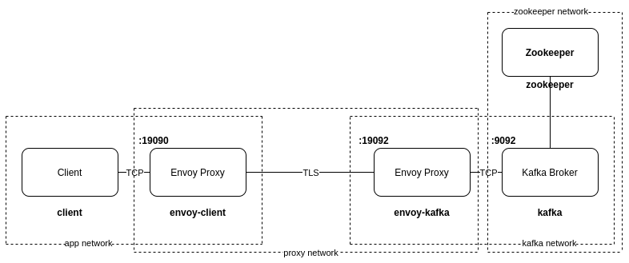

:toc:
:toc-title:
:toclevels: 2
:sectnums:

= Kafka Service Mesh

== Architecture

== Quickstart

1) Start all components:
-----
docker-compose up -d
-----

2) Send a request using the client:
-----
docker exec -it client bash
kafka-topics --bootstrap-server envoy:19090 --list
-----

== Debugging
To increase the log levels, the config has to be set when the container is running. E.g., for envoy-broker:
-----
docker exec -it envoy_broker bash
apt-get update
apt-get install curl
curl -X POST localhost:9901/logging?level=debug
-----
